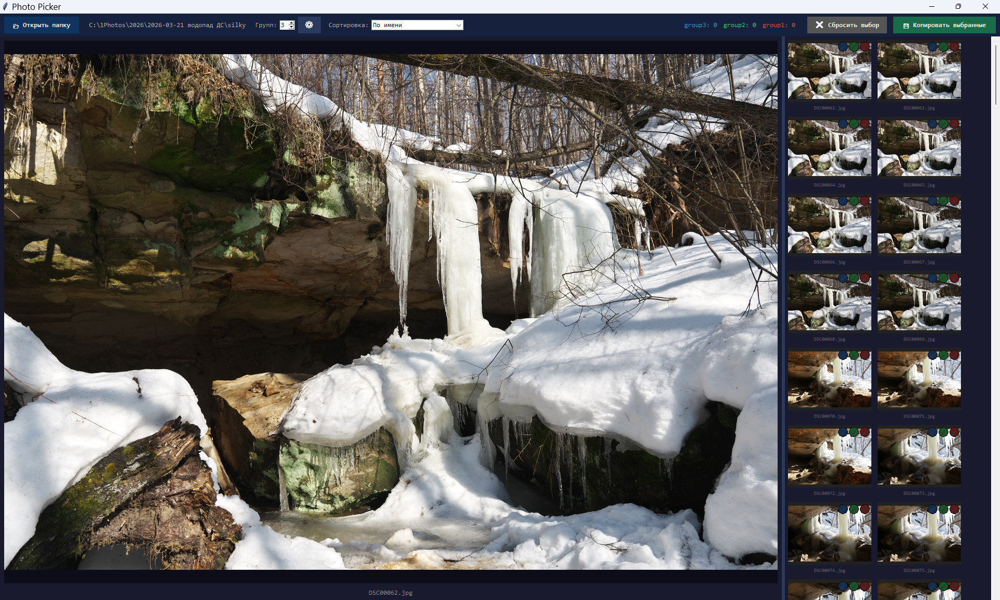

# Photo Picker

A fast, keyboard-friendly photo sorter for Windows. Browse a folder, assign photos to named groups (subfolders), then copy or synchronize them in one click.



## Features

- **Thumbnail grid** with lazy background loading — cells appear instantly, images load in priority order as you scroll
- **Large preview** panel with resizable splitter
- **Left-click zoom** — hold LMB on the preview to magnify the area under the cursor; move the mouse to inspect any part of the photo at pixel-perfect quality (no smoothing). Zoom level is configurable.
- **RGB histogram** — an overlay in the bottom-left corner of the preview shows the red, green, and blue channel distribution of the current photo. Toggle it with the **▦** button in the toolbar. Hovering a thumbnail shows that photo's histogram immediately.
- **Group membership dot** — thumbnails that already belong to any group show a small blue dot in the selection corner, so you can see at a glance which photos have been filed away.
- **Group management** — groups are real subfolders inside the source folder. The group dropdown reflects the actual folders on disk. Selecting an existing group loads its current contents as the selection.
- **RAW sidecars** — when copying or synchronizing a group, RAW files sitting next to a selected photo are copied along and removed together with it on sync (matched by file stem).
- **Compare peek** — hold the right mouse button on a thumbnail to flash that photo onto the large preview; release to return. Focus and selection stay on the current photo.
- **Smart copy button** — changes label and colour depending on context: create a new group, add photos to an existing one, or synchronize (adds missing files, removes deselected ones)
- **Keyboard navigation** — `←` `→` arrows, `Space` to toggle selection
- **Mouse wheel** — scrolls the grid or navigates photos (configurable)
- **Two-axis sort** — date order (oldest/newest) combined with orientation (mixed / landscape first / portrait first)
- **Preview-only mode** — hide the grid and work from the large image alone; the selection circle appears in the corner and is clickable
- **Settings dialog** — all options in one place, persisted between sessions
- **Safe copy** — files already present in the destination folder are skipped, never overwritten

## Requirements

- Python 3.8+
- [Pillow](https://python-pillow.org/)

```
pip install Pillow
```

## Installation

```bash
git clone https://github.com/YOUR_USERNAME/photo-picker.git
cd photo-picker
pip install Pillow
python photo_picker.py
```

Or pass a folder directly:

```bash
python photo_picker.py C:\Photos\Vacation
```

### Windows: double-click launcher

`photo_picker.bat` is included — just double-click it. If Python or Pillow is missing it prints an error and pauses.

## Usage

### Basic workflow

1. Click **📂 Open folder** (or pass a path on the command line).
2. Click a thumbnail to open it in the large preview. Use **← →** or the mouse wheel to navigate.
3. Press **Space** (or click the circle on the thumbnail / preview) to toggle the photo in or out of the current selection.
4. Type a name in the **New group name** field (the focused field is marked with a blue border) and click **💾 Copy selected** to create a subfolder and copy the photos into it, together with any matching RAW sidecar files. Folder-name rules: the symbols `\ / : * ? " < > |` and a trailing dot are rejected.

### Working with existing groups

- The **Group** dropdown lists all subfolders found inside the source folder.
- Selecting a group loads its current contents as the active selection.
- While a group is selected, the **New group name** field is disabled — it only applies when **(no group)** is chosen.
- After adjusting the selection, the copy button switches to **Add to "…"** (green) or **Synchronize "…"** (orange) as needed.
  - **Add** — copies newly selected photos into the folder, leaves existing ones untouched.
  - **Synchronize** — copies new selections in and removes deselected photos from the folder (RAW sidecars included), bringing it exactly in line with the current selection.

### Left-click zoom

Hold the **left mouse button** on the preview image to activate zoom. The view magnifies the area directly under the cursor — move the mouse to pan around the full image. Release LMB to return to the normal preview.

Zoom level (default 200%) is set in **Settings → Left-click zoom**.

### Compare peek

Hold the **right mouse button** on a thumbnail to show that photo on the large preview instead of the current one — navigation focus and selection do not change. Release the button to go back. While peeking, the preview is framed in orange and the file name is marked "(compare)". Right-clicking the current photo's own thumbnail does nothing.

### Keyboard shortcuts

| Key | Action |
|-----|--------|
| `←` `→` | Previous / next photo |
| `Space` | Toggle current photo in/out of selection |
| `Enter` / `Esc` | In the group name field: commit the name and return to the grid |

Arrow keys and `Space` act on photos only while focus is outside text fields (group name entry, dropdowns, dialogs). Interacting with any photo — a thumbnail click, the preview, zoom — returns the keyboard to the grid.

### Sort controls (top bar)

Two dropdowns next to the **Sort:** label work together:

| Dropdown | Options | Effect |
|----------|---------|--------|
| Date | Date ↑ oldest first | Oldest files first |
| | Date ↓ newest first | Newest files first |
| Orientation | Mixed | No orientation split; date order preserved |
| | Landscape first | Landscape photos before portrait |
| | Portrait first | Portrait photos before landscape |

### Settings (⚙ button)

| Option | Description |
|--------|-------------|
| Mouse wheel | Scroll the thumbnail grid **or** navigate photos (prev / next) |
| Preview only | Hide the thumbnail grid; selection circle appears on the preview |
| Left-click zoom level | Magnification factor when holding LMB (110%–800%, default 200%) |

Settings are saved to `%LOCALAPPDATA%\PhotoPicker\settings.json` and restored on next launch.

## Supported formats

Photos: `.jpg` `.jpeg` `.png` `.gif` `.bmp` `.webp` `.tiff` `.tif`

RAW sidecars (not shown in the grid; copied and removed together with their photo): `.arw` `.cr2` `.cr3` `.nef` `.dng` `.orf` `.rw2` `.raf`

## Settings file

`%LOCALAPPDATA%\PhotoPicker\settings.json`

```json
{
  "date_sort": "Date ↑ oldest first",
  "orient_sort": "Mixed",
  "splitter_ratio": 0.42,
  "wheel_nav": false,
  "preview_only": false,
  "zoom_factor": 200,
  "show_histogram": true
}
```

Unknown keys are ignored and preserved on save.

## License

MIT — see [LICENSE](LICENSE).
